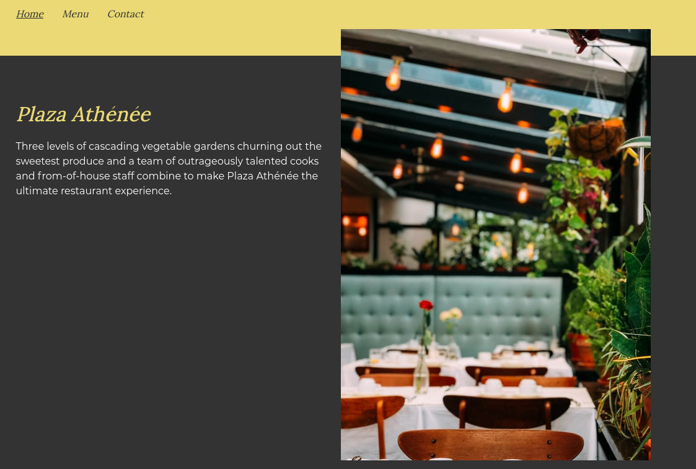

<!-- PROJECT SHIELDS -->

[![Forks][forks-shield]][forks-url]
[![Stargazers][stars-shield]][stars-url]
[![Issues-open][issues-open-shield]][issues-url]
[![Issues-closed][issues-closed-shield]][issues-url]
[![Contributors][contributors-shield]][contributors-url]
[![Framework][badge-framework]][framework-url]
[![contributions welcome][contributions-welcome]][issues-url]

<!-- PROJECT LOGO -->
<br />
<p align="center">
  <a href="https://github.com/Israel-Laguan/Restaurant-Page">
    
  </a>

  <h1 align="center">
	Restaurant Page
  </h1>

  <p align="center">
    Dynamically rendering a restaurant homepage with JS and webpack
    <br />
	  🖊️
    <a href="https://www.theodinproject.com/courses/javascript/lessons/restaurant-page">Assignment</a>
    🐞
    <a href="https://github.com/Israel-Laguan/SUSHI-FUSION/issues">Report a Bug</a>
    🙋‍♂️
    <a href="https://github.com/Israel-Laguan/SUSHI-FUSION/issues">Request Feature</a>
  </p>
</p>

[](http://plaza-athenee.surge.sh/)

# The Project

Plaza Athénée is a fictional restaurant based in USA. They have requested your help to build a website that will help them reach to younger public. They want it to be fast, dynamic and responsive.

## Well...

In fact this is for Microverse based in this [requirements](https://www.theodinproject.com/courses/javascript/lessons/restaurant-page).

> Restaurant Page project is part of a series of projects to be completed by students of Microverse.

The Restaurant Page is a JavaScript project, built using DOM manipulation and webpack. The restaurant shows a description of the services, a menu with some dishes (with a _delicate_ animation), and a welcoming contact page. Most of the web is created using JavaScript String Templates, changing the view dynamically with event listeners.

I created the design, configured the project and coded the webpage, so I was the designer, UI/UI engineer, Web Programmer, etc.

# Features

- Data Structures
- Object Oriented Programming
- Factory Functions
- Single Responsibility
- Tightly Coupled Objects
- Module Pattern
- ES6 syntax
- Export/import ES6+ notation
- Linters
- Basic VanillaJS app with a single script or few commands
- JS modules and ES6+ available for most browsers
- Sets `stickler` on the repo
- Sets `eslint` rules
- Tests made with [`ESLint`](https://eslint.org/)
- Unit Testing with [`Jest`](https://jestjs.io/)
- Add `jest` and `eslint` to be callable with `npm`

# Tests

## `Eslint`


# Built With

- Webpack
- `ESLint`
- `npm`
- `vscode` with _ESLint_ extension
- Linux/GNU
- Love and Passion for code

# Live Demo [HERE](http://plaza-athenee.surge.sh/)

[](http://plaza-athenee.surge.sh/)


## Prerequisites

- `git`
- `npm` 6.13 +
- `node` 11.15 +
- A Text Editor like VSCode
- A browser like Firefox or Chrome

## Quick Start

```
git clone https://github.com/Israel-Laguan/SUSHI-FUSION.git
cd sushi-fusion
npm i && npm start
```

Then open [http://localhost:3000/](http://localhost:3000/) to see the app.

### Where are the generated files?

In `development` mode `webpack` does not write generated files to disk, in order to change it
switch `devServer.writeToDisk` to `true` in [webpack.dev.js](./webpack.dev.js). When you use `production ` mode, the generated files are on `dist/` folder.

### Run development build

To run the development build (the one that don't generate files) just run in the terminal `npm start`

## Production

- `npm run build` to prepare `html`, `css`, `js` files in `dist/` directory. The gerated files are ready to put in production, also you can open the `index.html` in your local browser so you can see the result.

## Run tests

Run `ESlint` with `npm run lint` to verify linter rules are applied correctly. If you want to auto correct you can run `npm run lint-fix`. Optionally you can run the linter and tests: `npm run linter && npm test`

## Future/planned features

- [ ] Reservation with a form
- [ ] Contact Form with a custom message
- [ ] Improve Home View
- [ ] Add Dishes and their description
- [ ] When you click a dish, you have a button to reservate that dish in the form
- [ ] Integrate Reservation with a Calendar/Events feature
- [ ] Add tests

# Author

<table style="width:100%">
  <tr>
    <td>
        <div align="center">
            <a href="./docs/img/photo.png" target="_blank" rel="author">
                
            </a>
            <h2>
                <a href="https://israel-laguan.github.io/" target="_blank" rel="author">
                    Israel Laguan
                </a>
            </h2>
        </div>
    </td>
    <td>
        <div align="center">
            <a href="mailto:israellaguan@gmail.com" target="_blank" rel="author">
                
                <h3>
                    Email me to 
                    <a href="mailto:israellaguan@gmail.com">
                        israellaguan@gmail.com
                    </a>
                </h3>
            </a>
            <a href="https://www.linkedin.com/in/israellaguan/" target="_blank" rel="author">
                
                <h3>
                    Connect to my Linkedin
                </h3>
            </a>
            <a href="https://github.com/Israel-Laguan" target="_blank" rel="author">
                
                <h3>
                    Check my GitHub Profile
                </h3>
            </a>
        </div>
    </td>
  </tr>
</table>

# Contributing

[![contributions welcome][contributions-welcome]][issues-url]

🤝 Contributions, issues and feature requests are welcome!
Feel free to check the [issues page][issues-url].

# 🤗 Show your support

Give a ⭐️ if you like this project!

# 🏅 Acknowledgements

- [Microverse](https://www.microverse.org/)
- [The Odin Project](https://www.theodinproject.com/)
- [Readme header author](https://github.com/collinsugwu/Microverse201-Enumerable-Methods)

I created this websites inspired form an original
<a href="https://www.freepik.com/free-photos-vectors/brochure">art created by freepik - www.freepik.com</a>

# License

[![License][badge-license]](http://badges.mit-license.org)

📝 This project is licensed under the [MIT](LICENSE)\
Feel free to fork this project and improve it

<!-- MARKDOWN LINKS & IMAGES -->

[contributors-shield]: https://img.shields.io/github/contributors/Israel-Laguan/SUSHI-FUSION?style=for-the-badge
[contributors-url]: https://github.com/Israel-Laguan/SUSHI-FUSION/graphs/contributors
[forks-shield]: https://img.shields.io/github/forks/Israel-Laguan/SUSHI-FUSION?style=for-the-badge
[forks-url]: https://github.com/Israel-Laguan/SUSHI-FUSION/network/members
[stars-shield]: https://img.shields.io/github/stars/Israel-Laguan/SUSHI-FUSION?style=for-the-badge
[stars-url]: https://github.com/Israel-Laguan/SUSHI-FUSION/stargazers
[issues-open-shield]: https://img.shields.io/github/issues/Israel-Laguan/SUSHI-FUSION?style=for-the-badge
[issues-url]: https://github.com/Israel-Laguan/SUSHI-FUSION/issues
[issues-closed-shield]: https://img.shields.io/github/issues-closed/Israel-Laguan/SUSHI-FUSION?style=for-the-badge
[badge-framework]: https://img.shields.io/badge/webpack-v4-9cf?style=for-the-badge
[framework-url]: https://webpack.js.org/
[contributions-welcome]: https://img.shields.io/badge/contributions-welcome-brightgreen.svg?style=for-the-badge
[badge-license]: https://img.shields.io/:license-mit-blue.svg?style=for-the-badge
